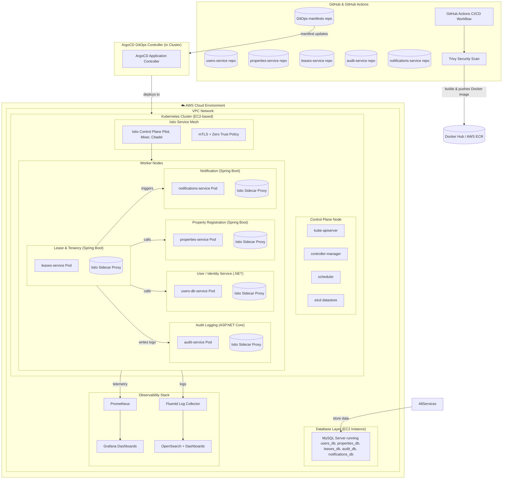

# 🏗️ Mermaid — Microservice & Infrastructure Deployment Architecture (with AWS + Istio + GitOps)
---

```mermaid
graph TD
    %% AWS Cloud
    subgraph AWS_Cloud["☁️ AWS Cloud Environment"]
        subgraph VPC["VPC Network"]
            
            subgraph K8sCluster["Kubernetes Cluster (EC2-based)"]
                
                subgraph ControlPlane["Control Plane Node"]
                    APIServer[kube-apiserver]
                    Controller[controller-manager]
                    Scheduler[scheduler]
                    ETCD[etcd datastore]
                end

                subgraph WorkerNodes["Worker Nodes"]
                    
                    subgraph UserService["User / Identity Service (.NET)"]
                        USvcApp[users-db-service Pod]
                        USvcSidecar[(Istio Sidecar Proxy)]
                    end

                    subgraph PropertyService["Property Registration (Spring Boot)"]
                        PSvcApp[properties-service Pod]
                        PSvcSidecar[(Istio Sidecar Proxy)]
                    end

                    subgraph LeaseService["Lease & Tenancy (Spring Boot)"]
                        LSvcApp[leases-service Pod]
                        LSvcSidecar[(Istio Sidecar Proxy)]
                    end

                    subgraph AuditService["Audit Logging (ASP.NET Core)"]
                        ASvcApp[audit-service Pod]
                        ASvcSidecar[(Istio Sidecar Proxy)]
                    end

                    subgraph NotificationService["Notification (Spring Boot)"]
                        NSvcApp[notifications-service Pod]
                        NSvcSidecar[(Istio Sidecar Proxy)]
                    end
                end

                subgraph ServiceMesh["Istio Service Mesh"]
                    IstioControl[Istio Control Plane Pilot, Mixer, Citadel]
                    mTLS[mTLS + Zero Trust Policy]
                end

            end

            subgraph DatabaseLayer["Database Layer (EC2 Instance)"]
                MySQL[MySQL Server running users_db, properties_db, leases_db, audit_db, notifications_db]
            end

            subgraph Monitoring["Observability Stack"]
                Prometheus[Prometheus]
                Grafana[Grafana Dashboards]
                Fluentd[Fluentd Log Collector]
                OpenSearch[OpenSearch + Dashboards]
            end
        end
    end

    subgraph GitHub["GitHub & GitHub Actions"]
        Repo1[(users-service repo)]
        Repo2[(properties-service repo)]
        Repo3[(leases-service repo)]
        Repo4[(audit-service repo)]
        Repo5[(notifications-service repo)]
        Repo6[(GitOps manifests repo)]
        CI[GitHub Actions CI/CD Workflow]
        Trivy[Trivy Security Scan]
    end

    subgraph ArgoCD["ArgoCD GitOps Controller (in Cluster)"]
        ArgoDeploy[ArgoCD Application Controller]
    end

    %% Connections
    CI --> Trivy
    Trivy -->|builds & pushes Docker image| DockerHub[(Docker Hub / AWS ECR)]
    Repo6 -->|manifest updates| ArgoCD
    ArgoCD -->|deploys to| K8sCluster
    WorkerNodes -->|telemetry| Prometheus
    WorkerNodes -->|logs| Fluentd
    Fluentd --> OpenSearch
    Prometheus --> Grafana
    IstioControl --> WorkerNodes
    LeaseService -->|calls| PropertyService
    LeaseService -->|calls| UserService
    LeaseService -->|writes logs| AuditService
    LeaseService -->|triggers| NotificationService
    AllServices -->|store data| MySQL
```
---

