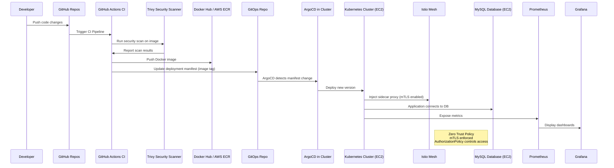

# 🏗️ **High-Level Mermaid — CI/CD + GitOps + Security Flow**

```mermaid
sequenceDiagram
    participant Dev as Developer
    participant GitHub as GitHub Repos
    participant CI as GitHub Actions CI
    participant Trivy as Trivy Security Scanner
    participant Registry as Docker Hub / AWS ECR
    participant GitOps as GitOps Repo
    participant ArgoCD as ArgoCD in Cluster
    participant K8s as Kubernetes Cluster (EC2)
    participant Istio as Istio Mesh
    participant MySQL as MySQL Database (EC2)
    participant Prometheus as Prometheus
    participant Grafana as Grafana

    Dev->>GitHub: Push code changes
    GitHub->>CI: Trigger CI Pipeline
    CI->>Trivy: Run security scan on image
    Trivy->>CI: Report scan results
    CI->>Registry: Push Docker image
    CI->>GitOps: Update deployment manifest (image tag)
    GitOps->>ArgoCD: ArgoCD detects manifest change
    ArgoCD->>K8s: Deploy new version
    K8s->>Istio: Inject sidecar proxy (mTLS enabled)
    K8s->>MySQL: Application connects to DB
    K8s->>Prometheus: Expose metrics
    Prometheus->>Grafana: Display dashboards
    Note right of Istio: Zero Trust Policy<br/>mTLS enforced<br/>AuthorizationPolicy controls access
```

---
