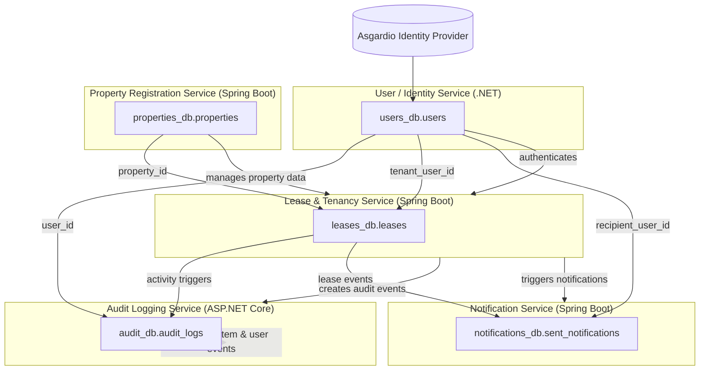
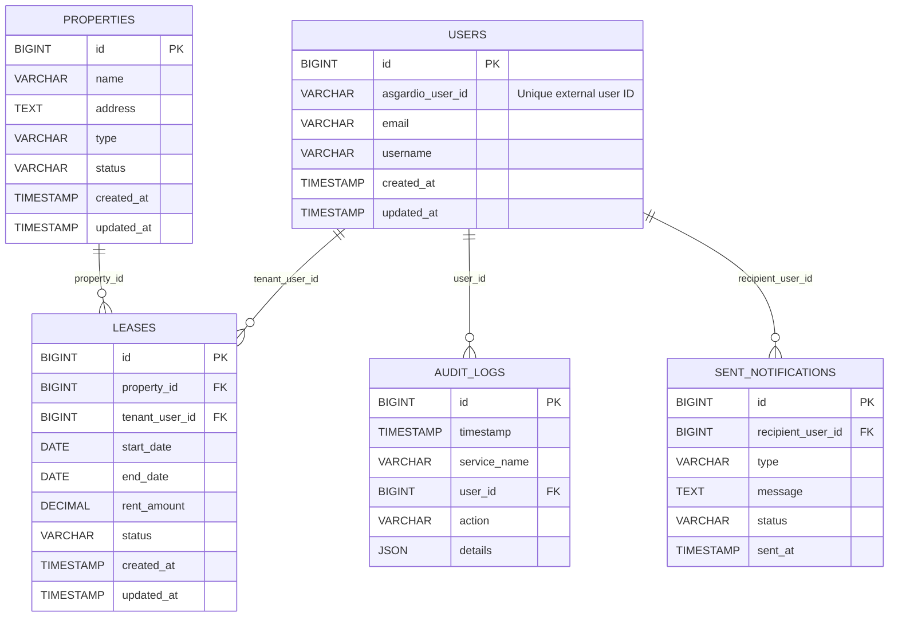

# 🧱 Multi-Database System Architecture and ER Diagram

This document describes the database architecture and table relationships for a distributed property and lease management system consisting of multiple services.

---

## 🏗️ **High-Level System Architecture Diagram**

---

## 🧱 **Entity Relationship (ER) Diagram**

---

## 💡 **Summary**

| Service | Database | Key Table | Description |
|----------|-----------|------------|--------------|
| **User/Identity Service (.NET)** | `users_db` | `users` | Manages all authenticated users (linked via Asgardio ID). |
| **Property Service (Spring Boot)** | `properties_db` | `properties` | Manages property details (buildings, apartments, lands). |
| **Lease Service (Spring Boot)** | `leases_db` | `leases` | Links users to properties and tracks lease durations & rent. |
| **Audit Service (ASP.NET Core)** | `audit_db` | `audit_logs` | Tracks actions across all services for compliance. |
| **Notification Service (Spring Boot)** | `notifications_db` | `sent_notifications` | Stores sent/failed user notifications. |
